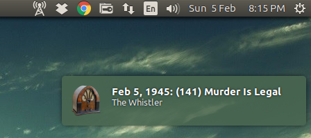

# Radiotray-NG: An Internet radio player for Linux #

It became clear as one of the early contributors to the RadioTray project that it
was not getting the attention it required and was probably dead. A lot of the 
technologies it used had moved on to newer versions and the bugs started piling up.
I did my best to help users, but a new start was required. So, in early 2016 I began
to write a new version. 

The version here is what "I" wanted out of RadioTray.

## Radiotray-NG goals were: ##

* Cross platform friendly design as I occasionally use a Mac.
* Better gstreamer error handling and recovery.
* Fix RadioTray's flawed bookmark format.
* Build in the only RadioTray plugin that I felt I needed, which is a shutdown timer.
* Per station/group notification icon support.
* Better parsing of the stream meta data and optionally more stream info displayed.
* A bit more attention to notification details and formatting.

## Where Radiotray-NG is: ##

* RadioTray functionality for Ubuntu
* Theme support
* Debian packaging
* Some unit tests, but needs more!
* Cross compile on Mac (via brew packages) using a very simple ncurses interface.
* Full AppIndicator support
* No groups within groups by design to keep the interface clean.
* Volume up/down support using mouse wheel
* Media key support

## Future: ##

* Cross platform bookmark editor application. (I like editing the JSON by hand, but some may not care for that.) 
* Finish ncurses interface
* Mac support (icons, menu, media keys etc.) (I need help here.)
* Native support for Gnome desktop? (AppIndicator plugin seems to work fine though.)
* Script to convert RadioTray's bookmarks.xml to the new format.
* Mpris support?
* Better handling of any JSON parsing errors.

**Icons:** [http://www.iconsplace.com/]
**License:** Creative Commons Attribution-NoDerivs 3.0 Unported

## Bugs: ##

* Radiotray-NG's user-agent is created at compile time. Which means a binary created on 16.10 will report that even when run on 16.04.
* Plenty, I'm sure.

## Screenshots: ##





###############################################################################

## Install ##

Download the latest Debian package from the repo's release page.

https://github.com/ebruck/radiotray-ng/releases

## Config File ##

A config is created in your ~/.config/radiotray-ng directory with the following defaults:

```
{
   "bookmarks" : "~/.config/radiotray-ng/bookmarks.json",
   "debug-logging" : false,
   "last-station" : "",
   "last-station-group" : "",
   "notification-verbose" : true,
   "notifications" : true,
   "sleep-timer" : 30,
   "split-title" : true,
   "tag-info-verbose" : true,
   "volume-level" : 100
}
```


```
           bookmarks: location of bookmarks file
       debug-logging: enable/disable verbose debug logging
notification-verbose: more status information than normal
       notifications: turns on/off notification messages
         sleep-timer: value is in minutes
         split-title: attempts to reformat the notification into title/artist
    tag-info-verbose: displays in the menu stream information such as bitrate etc.
```
Do not edit the config while Radiotray-NG is running or your changes will be lost.

## Bookmarks Format ##

Bookmarks are defined in the following JSON format:


```
[
   {
      "group" : "group name 1",
      "image" : null,
      "stations" : [
         {
            "image" : null,
            "name" : "station name",
            "url" : "http://station/station.pls"
         },
         ...         
        ]
   },
   {
      "group" : "group name 2",
      "image" : "~/Dropbox/radiotray-ng/images/station.png",
      "stations" : [
         {
            "image" : null,
            "name" : "station name",
            "url" : "http://station/station.pls"
         },
         ...
        ]
   },
   ...
]
```

   
Group with the name "root" is treated differently and is rendered at the base of the menu.
A group's image specifies the notification icon to display and is inherited by all of the stations.
A station with an image overrides the group image.

Use the "Preferences/Reload Bookmarks" option to see your changes.

## To Build: ##

Install these packages:


```
libcurl4-openssl-dev
libjsoncpp-dev
libxdg-basedir-dev
libnotify-dev
libboost-filesystem-dev
libgstreamer1.0-dev
libappindicator-dev
libboost-log-dev
libgtk-3-dev
libnotify-dev
lsb-release
libbsd-dev
cmake

```

## GoogleTest (optional) ##


```
$ git clone git@github.com:google/googletest.git
$ cd googletest
$ mkdir build
$ cd build
$ cmake ..
$ sudo make install
```


## Build Radiotray-NG & Debian Package ##


```
$ cmake <path-to-source>/radiotray-ng -DCMAKE_BUILD_TYPE=Release
$ make package

```