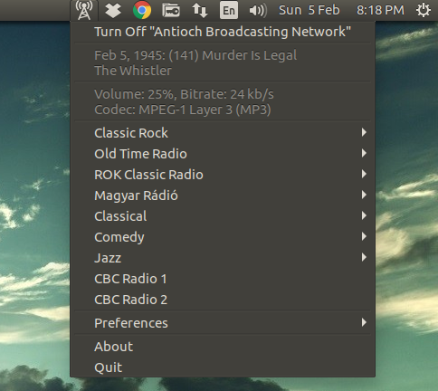
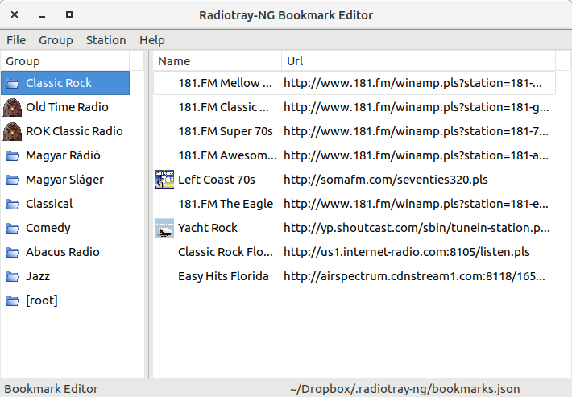
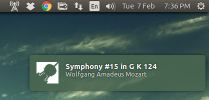
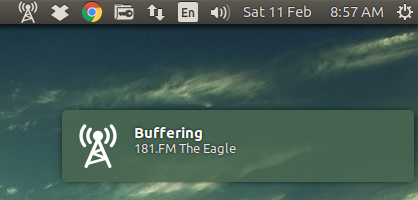
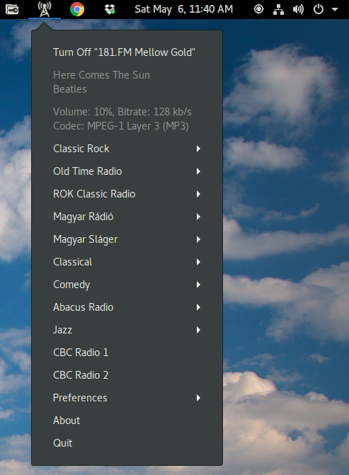
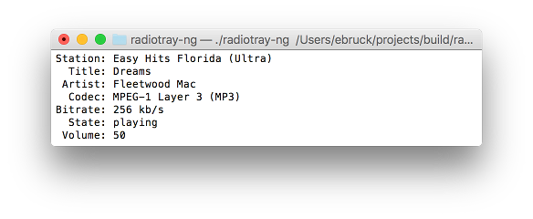

# Radiotray-NG: An Internet radio player for Linux #
[](https://circleci.com/gh/ebruck/radiotray-ng/tree/master)

It became clear as one of the early contributors to the RadioTray project that it
was not getting the attention it required and was probably dead. A lot of the
technologies it used had moved on to newer versions and the bugs started piling up.
I did my best to help users, but a new start was required.

The version here is what "I" wanted out of RadioTray.

## Radiotray-NG goals were: ##

* Better gstreamer error handling and recovery.
* Fix RadioTray's flawed bookmark format.
* Build in the only RadioTray plugin that I felt I needed, which is a shutdown timer.
* Per station/group notification icon support.
* Better parsing of the stream meta data and optionally more stream info displayed.
* A bit more attention to notification details and formatting.

## Where Radiotray-NG is: ##

* RadioTray functionality
* Theme support
* Debian packaging
* Full AppIndicator support
* No groups within groups by design to keep the interface clean.
* Volume up/down support using mouse wheel (left/right can also be used)
* Media key support
* Dbus interface for controlling Radiotray-NG and accessing stream meta data
* --play command line option for resuming playback

**Icons:** [http://www.iconsplace.com/]
**License:** Creative Commons Attribution-NoDerivs 3.0 Unported

## Bugs: ##

* Radiotray-NG's user-agent is created at compile time. Which means a binary created on 16.10 will report that even when run on 16.04.

## Screenshots: ##










## Config File ##

A config (radiotray-ng.json) is created in your ~/.config/radiotray-ng directory with the following defaults:
```
{
   "bookmarks" : "~/.config/radiotray-ng/bookmarks.json",
   "bookmark-editor" : "rtng-bookmark-editor",
   "buffer-duration" : 2,
   "buffer-size" : 320000,
   "compact-menu" : false,
   "debug-logging" : false,
   "disable-logging" : false,
   "file-monitor" : true,
   "file-monitor-interval" : 10,
   "invert-menu" : false,
   "last-station" : "",
   "last-station-group" : "",
   "notification-verbose" : true,
   "notifications" : true,
   "sleep-timer" : 30,
   "split-title" : true,
   "track-info-copy" : false,
   "ihr-title" : true,
   "tag-info-in-label" : false,
   "tag-info-in-label-len" : 80,
   "tag-info-in-label-artist": true,
   "tag-info-verbose" : false,
   "volume-level" : 100,
   "volume-step" : 1,
   "volume-max-level" : 200,
   "wrap-track-info" : true,
   "wrap-track-info-len" : 40,
   "media-key-mapping" : false,
   "media-key-previous-station" : "Previous",
   "media-key-next-station" : "Next",
   "media-key-volume-up" : "",
   "media-key-volume-down" : "",
   "media-keys-old-dbus-name" : false,
   "radiotray-ng-on" : "radiotray-ng-on",
   "radiotray-ng-off" : "radiotray-ng-off",
   "radiotray-ng-notification" : "radiotray-ng-notification",
   "root-group-bottom-pos" : true
}
```
* **Installed config will only include commonly edited entries, all others are using default values shown above.**
```
                 bookmarks: location of bookmarks file
           bookmark-editor: bookmark editor to launch
               buffer-size: size of buffer in bytes
           buffer-duration: number of seconds to buffer
             compact-menu : enable/disable the use of menu separators
             debug-logging: enable/disable verbose debug logging
           disable-logging: enable/disable logging
              file-monitor: enable/disable notification of bookmark file changes
     file-monitor-interval: time in seconds to poll for bookmark file changes
              invert-menu : menu rendered in reverse order
      notification-verbose: more status information than normal
             notifications: turns on/off notification messages
               sleep-timer: value is in minutes
               split-title: attempts to reformat the notification into title/artist
                 ihr-title: extra parsing for iheartradio formatting (requires split-title)
         tag-info-in-label: display title & artist next to icon
     tag-info-in-label-len: maximum title & artist line length
  tag-info-in-label-artist: include artist in icon label
          tag-info-verbose: displays in the menu stream information such as bitrate etc.
           track-info-copy: enable/disable track clicking to copy into clipboard
               volume-step: value used to increment/decrement the volume level
          volume-max-level: maximum volume level
           wrap-track-info: enable/disable the wrapping of title & artist menu text
       wrap-track-info-len: maximum title & artist line length
         media-key-mapping: enable the mapping of media keys to volume up/down etc. (Previous, Next, Rewind, FastForward etc.)
media-key-previous-station: media key to use for previous station within current group
    media-key-next-station: media key to use for next station within current group
       media-key-volume-up: media key to use for volume up
     media-key-volume-down: media key to use for volume down
  media-keys-old-dbus-name: force the use of old dbus name
           radiotray-ng-on: installed theme icon name for "on" or path to image
          radiotray-ng-off: installed theme icon name for "off" or path to image
 radiotray-ng-notification: installed theme icon name for "notification" or path to image
     root-group-bottom-pos: render root group stations at bottom or top of menu

```
* Do not edit the config while Radiotray-NG is running or your changes will be lost.
* No checks are made if a media key assignment collides with another action.

## Bookmarks Format ##

Bookmarks are defined in the following JSON format:
```
[
   {
      "group" : "group name 1",
      "image" : null,
      "stations" : [
         {
            "image" : null,
            "name" : "station name",
            "url" : "http://station/station.pls"
         },
         ...
        ]
   },
   {
      "group" : "group name 2",
      "image" : "~/Dropbox/radiotray-ng/images/station.png",
      "stations" : [
         {
            "image" : null,
            "name" : "station name",
            "url" : "http://station/station.pls",
            "notifications" : false
         },
         ...
        ]
   },
   ...
]
```
Group with the name "root" is treated differently and is rendered at the base of the menu. A group's image specifies the notification icon to display and is inherited by all of the stations. A station with an image overrides the group image.

Use the "Preferences/Reload Bookmarks" option to see your changes.


## Convert RadioTray Bookmarks ##

The rt2rtng script will convert your RadioTray bookmarks.xml file. All groups within groups are moved to the root and any empty ones are removed. It's not a perfect conversion and will no doubt require some editing.

```
$ rt2rtng ~/.local/share/radiotray/bookmarks.xml > bookmarks.json
```


## Bookmarks Editor ##

The Bookmarks Editor is a simple editor that enables management of your bookmarks file eliminating the need for manually editing the file. The editor will attempt to open the default bookmarks file on startup, but you can select to open another bookmarks file if desired. This provides you with the ability to manage multiple bookmark files.

The editor supports all of the typical editor operations including adding, editing and deleting of both groups and stations. Images are easily selected via standard browsing functionality. You can also arrange the groups and stations using simple drag-n-drop actions.

* Use Radiotray-NG's reload bookmarks after saving your changes.

## DBus Interface ##

```
Available commands:

    get_bookmarks
    get_config
    get_player_state
    play
    play_station 'group' 'station'
    play_url 'url'
    previous_station
    next_station
    reload_bookmarks
    set_volume 'level'
    volume_down
    volume_up
    mute
    stop
    quit
```
```
Example:

$ qdbus com.github.radiotray_ng /com/github/radiotray_ng com.github.radiotray_ng.get_player_state
{
   "artist" : "Suspense",
   "bitrate" : "24 kb/s",
   "codec" : "MPEG-1 Layer 3 (MP3)",
   "group" : "Old Time Radio",
   "image" : "radiotray-ng-notification",
   "mute" : false,
   "state" : "playing",
   "station" : "AM 1710 Antioch OTR",
   "title" : "Jul 15, 1948: Summer Night w/Ida Lupino",
   "url" : "http://radio.macinmind.com/listen.m3u",
   "volume" : "15"
}
```

## Install ##

Download a release or clone the repo and build the latest Debian package.

https://github.com/ebruck/radiotray-ng/releases

Install Appindicator extension if not running Ubuntu.

https://extensions.gnome.org/extension/615/appindicator-support/

## Fedora Install ##
```
$ dnf install radiotray-ng
```

## To Build on Ubuntu: ##

Install these packages:
```
lsb-release libcurl4-openssl-dev libjsoncpp-dev libxdg-basedir-dev libnotify-dev libboost-filesystem-dev libgstreamer1.0-dev libboost-log-dev libboost-program-options-dev libgtk-3-dev libnotify-dev lsb-release libbsd-dev libglibmm-2.4-dev cmake

# For Ubuntu 23.10 and newer install:
libayatana-appindicator3-dev libwxgtk3.2-dev
# For Ubuntu 22.04 install:
libayatana-appindicator3-dev libwxgtk3.0-gtk3-dev libwxgtk3.0-gtk3-0v5
# Before ubuntu 22.04:
libappindicator3-dev libwxgtk3.0-gtk3-dev libwxgtk3.0-gtk3-0v5
```

## Build Radiotray-NG & Debian Package ##
```
$ git clone https://github.com/ebruck/radiotray-ng.git
$ cd radiotray-ng
$ mkdir build
$ cd build
$ cmake .. -DCMAKE_BUILD_TYPE=Release
$ make package
$ sudo dpkg -i ./radiotray-ng_x.y.z_<distro>_<i386|amd64>.deb
$ sudo apt-get install -f
```

## Build Radiotray-NG + Tests & Debian Package ##
```
$ git clone https://github.com/ebruck/radiotray-ng.git
$ cd radiotray-ng
$ mkdir build
$ cd build
$ cmake .. -DBUILD_TESTS=ON -DCMAKE_BUILD_TYPE=Debug
$ make package
$ sudo dpkg -i ./radiotray-ng_x.y.z_<distro>_<i386|amd64>.deb
$ sudo apt-get install -f
```

## To Build on Fedora: ##

Install these packages:
```
redhat-lsb cmake libcurl-devel boost-devel wxGTK3-devel jsoncpp-devel gstreamer1-devel libxdg-basedir-devel libbsd-devel libappindicator-gtk3-devel libnotify-devel glibmm24-devel rpm-build
```

```
$ git clone https://github.com/ebruck/radiotray-ng.git
$ cd radiotray-ng
$ mkdir build
$ cd build
$ cmake .. -DCMAKE_BUILD_TYPE=Release
$ make package
$ sudo dnf install ./radiotray-ng_x.y.z_<distro>_<i386|x86_64>.rpm
```
